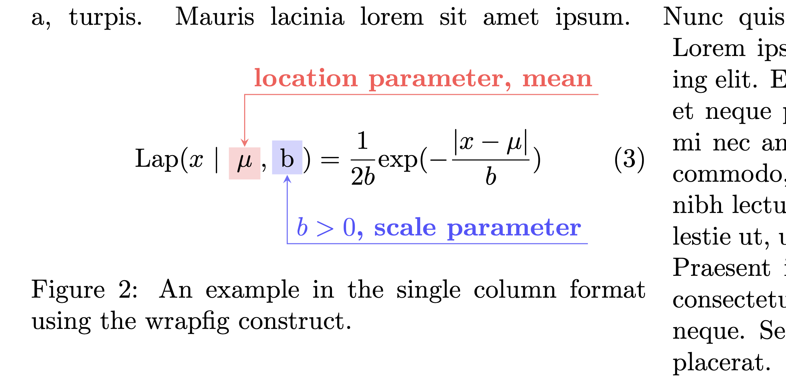

The file "eqn_annotate.tex" is the main latex file.

This repository provides four examples of annotated equations:

1. [example_prob.tex] A simple one inside the equation construct, in a double column format
2. [example_prob2.tex] A more complex one, but this time inside the figure construct in a double column format
3. [example_laplace.tex] Inside the wrapfigure construct but for a single column format
4. [example_overlay.tex] More complicated examples, side-by-side using the minipage construct in a single column format

The folder, "example_output_figs" includes figures that show the outputs of the above four cases.

Note: the main latex file, "eqn_annotate.tex" includes many latex packages and some definitions that are required.

To build all the examples into a single file, type:
> make

OR 

> pdflatex (or xelatex) eqn_annotate

The output PDF file (containing all the examples) is named: eqn_annotate.pdf

NOTE: the "make" command will show the following errors at the end:
> I found no \citation commands---while reading file eqn_annotate.aux
> I found no \bibdata command---while reading file eqn_annotate.aux
> I found no \bibstyle command---while reading file eqn_annotate.aux

This is due to the fact that the latex files contain no bibtex entries or citations. This is normal. If you include a bib file and one or more citations then the errors will go away.

# Examples #

* [example_prob.tex] A simple one inside the equation construct, in a double column format

* [example_prob2.tex] A more complex one, but this time inside the figure construct in a double column format

* [example_laplace.tex] Inside the wrapfigure construct but for a single column format

* [example_overlay.tex] More complicated examples, side-by-side using the minipage construct in a single column format

